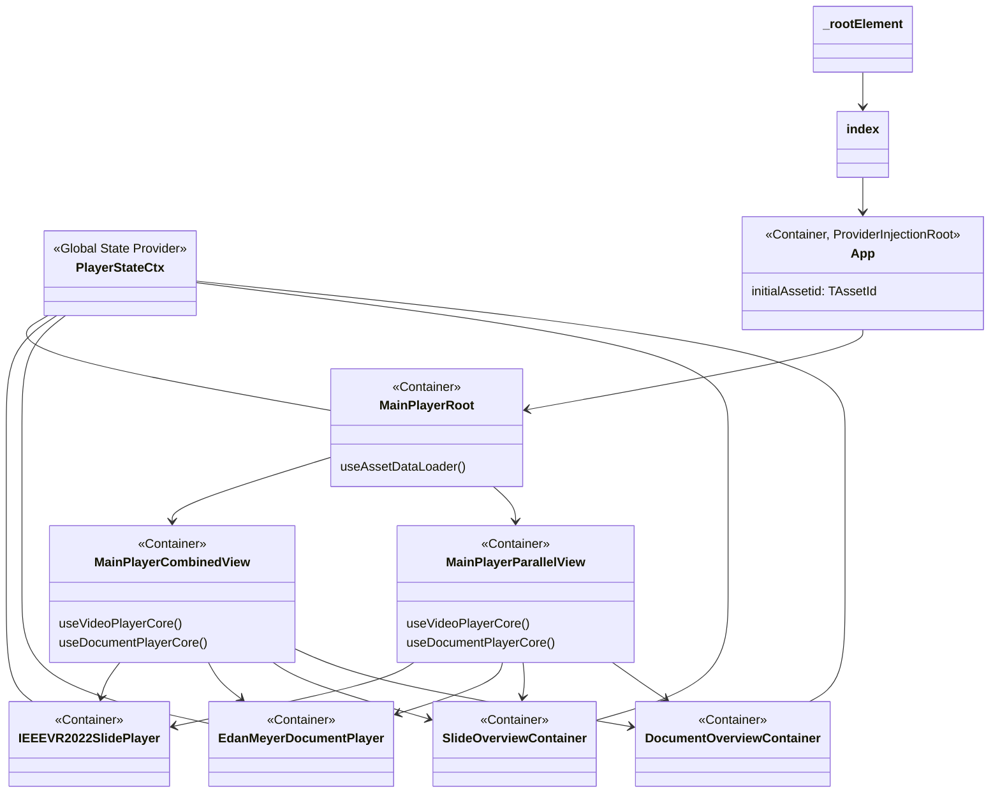

# PoC-User-Study Updation UI DEMO

りどみ

### How to run App (on dev server)

アプリ動作のための環境構築について．  
おおよそ 5 分程度で終わります．簡単です．

#### 1. [Node.js をダウンロード&インストール](https://nodejs.org/ja)

- https://nodejs.org/ja
  - v16 以上，v18 系も動作可能
- `npm -v` の結果が出力されれば OK
- 既に v16 以降をインストール済みの場合は飛ばしてください

#### 2. ターミナルでこの README.md のディレクトリを開く

- 

#### 3. `npm install`を実行

- package.json に書かれた必要モジュールをインストールします

#### 4. `npm run dev` を実行

- ターミナル上に以下のような表示が出たら成功です
  - 

#### 5. ブラウザで http://localhost:3070/ にアクセス

- 上手くいけば Edan さんの Minecraft の動画（EdanMeyerVpt）が表示されます
  - 

### How to use App

#### 動画の操作

- 操作方法は一般的な動画プレイヤーと全く同じです
- 一時停止・再生，（字幕データがあれば）字幕表示，ドキュメントの切り替えボタンが表示されています
  - 

#### 動画 → 資料の切り替え

- 
- 画面右下のドキュメント起動ボタン("Click to Show Document")を押すと，資料ビューアが起動します．
- もしくは，資料が表示されている動画のパートが再生されている時に，動画ビューア上でスクロール操作を行うと資料ビューアが起動します
- 初めて資料ビューアを起動する場合，若干もたつきます．要改良．(資料ビューアコンポーネントの初期化処理に起因)

#### 資料 → 動画の切り替え

- 
- 画面右下のドキュメント起動ボタンを押すと，資料ビューアが終了します．
- もしくは，右下のワイプ画面をクリックすると消えます．

#### アセットの選択

- 動画 + 資料の組み合わせパターンをアセットと呼称します．
- 画面左上の "Change Asset" ボタンをクリックすると，アセット選択画面が出現します．
  - 
- 現状のデモは３つのアセットを選択可能です．見たいアセットをクリックで選択してください．
  - EdanMeyerVpt (Document) ← Default
  - IEEEVR2022Ogawa (Slide)
  - IEEEVR2022Hoshikawa (Slide)
  - 
- アセット選択画面を閉じるには，ダイアログの枠外をクリックしてください．

#### 追加予定機能

- (~8/8) PDF.js を組み込むことで，ドキュメントにテキストレイヤーを追加
  - テキストベースのインタラクションをサポート
- (~8/8) CHI2021Fujita アセットを追加
  - 藤田先生の CHI2021 における発表映像のアセットです．

### App Component Tree

