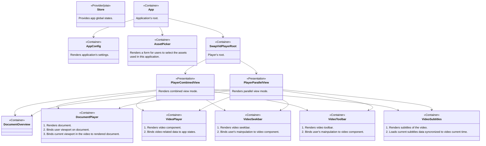

 
  

# SwapVid Frontend

A frontend component of SwapVid application, built on Vite + TypeScript + React.  
Please visit **[SwapVid demonstration app website](https://swapvid-demo.web.app)** to use built version of this app.

This app contains below component of SwapVid:
- SwapVid user interface
- SwapVid Desktop application

## Getting started

1. Install [Docker Desktop](https://www.docker.com/products/docker-desktop/)
2. Install WSL2 (for windows)
3. Install [GNU Make](https://www.gnu.org/software/make/) (optional)

## Usage

The command `make run` activates the container and dev server. After the container runs, you can access dev mode of SwapVid from http://localhost:3070

And if you want to build the app, please use  `make build` command.

You can use `make deploy` command to build and deploy the development build.

## Components

